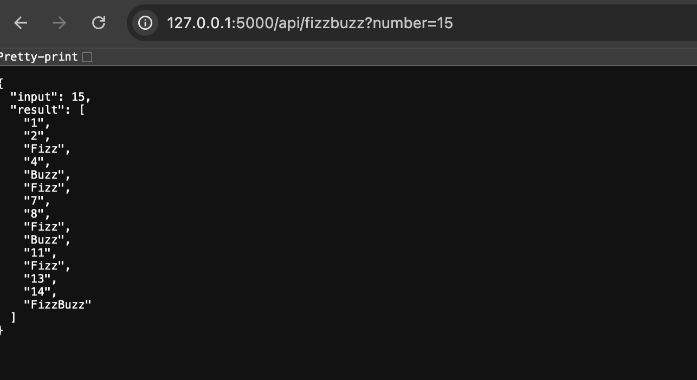
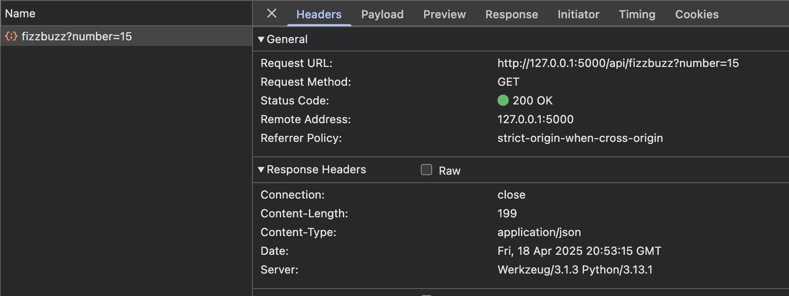
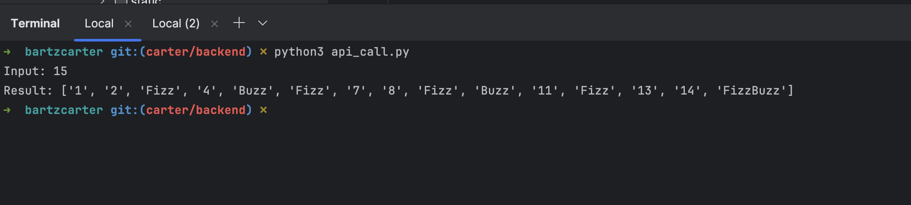
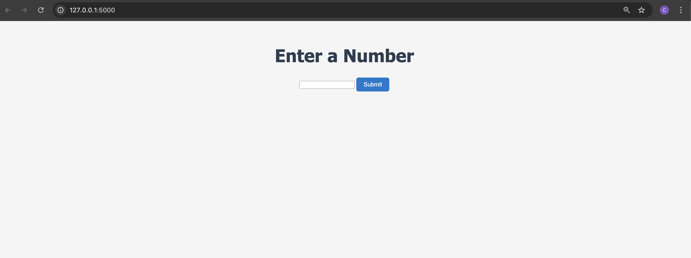
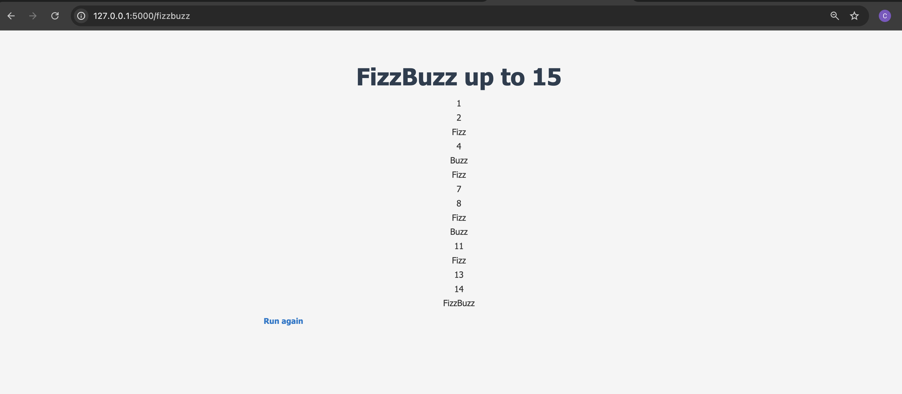

# FizzBuzz Python and Shell Script

This project includes a Python program that implements a simple **FizzBuzz** algorithm with customized output, along with a shell script to run the Python program with optional arguments.

### FizzBuzz Logic

The program prints numbers from 1 to a given number `n` (defaults to 15 if no argument is provided). However, for numbers divisible by:

- 3, it prints **"Bob"**,
- 5, it prints **"Cat"**,
- and for numbers divisible by both 3 and 5, it prints **"BobCat"**.

### Files in the Project

- **`main.py`**: The Python program that contains the FizzBuzz implementation.
- **`run.sh`**: The shell script that checks if an argument is passed. If an argument is provided, it runs the Python script with that argument; if not, it runs the Python script with the default value `15`.

---

## How to Use

### 1. **Run the Python Program Directly**

You can run the Python program directly by executing:

```bash
python3 main.py [n]
```

from directory the file lives in or ...

### 2. **Run the Python Program with the Shell Script from the repo top level directory**

```bash
./problems/fizzbuzz/python/bartzcarter/run.sh [n]
```
---
## Testing

### 1. **Run the Test Program Directly**

You can run the Test program directly by executing:

```bash
python -m unittest test.py
```

from the directory the file lives in or ...

### 2. **Run Using the Shell Script From The /python/bartzcarter Directory**

```bash
./run_tests.sh
```
# FizzBuzz API endpoint in Flask

### app.py takes the solution/function and expose it as an API endpoint on a local web server (flask). 

#### How to call the API and some example request / response pairs:

Run app.py to bring up the server

```bash
python3 ./problems/fizzbuzz/python/bartzcarter/app.py
```

Navigate to: http://127.0.0.1:5000 where the app is being served

In the change the url to http://127.0.0.1:5000/api/fizzbuzz?number=<>  ... specify the input number by replacing <>

This hits the endpoint and returns a JSON response


<br>


## Another way to hit the API is through api_call.py which uses Python requests

```bash
python3 ./problems/fizzbuzz/python/bartzcarter/api_call.py
```

Running this file will also hit the end point and return a JSON response:


<br>

In this example the response is being printed to std out

Here is the api call :

```
import requests

response = requests.get("http://127.0.0.1:5000/api/fizzbuzz", params={"number": 15})

if response.status_code == 200:
    data = response.json()
    print("Input:", data["input"])
    print("Result:", data["result"])
else:
    print("Error:", response.status_code)
```

## The server is also set up to display the fizzbuzz functionality in a web page

This is done by utilizing jinja 2 templating

Once the server is running, navigate to ```http://127.0.0.1:5000```


<br>

Submit the form and the fizzbuzz solution is displayed.


<br>

