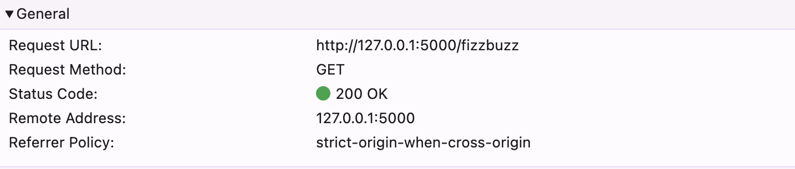
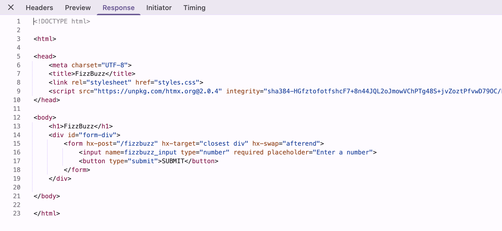
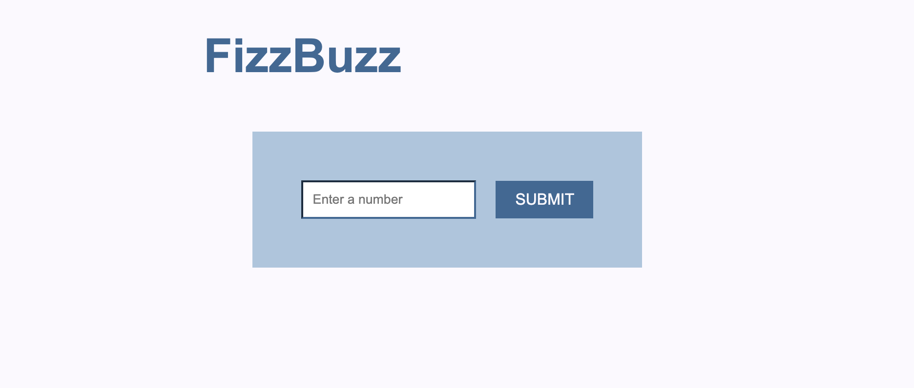
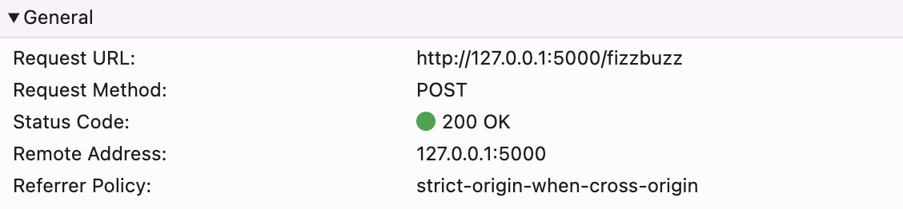
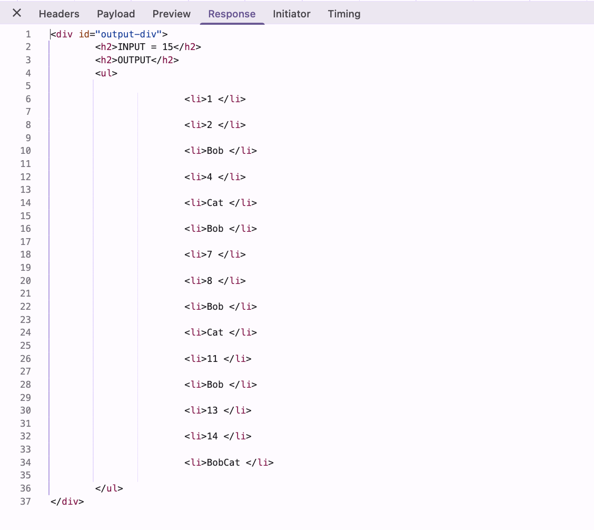
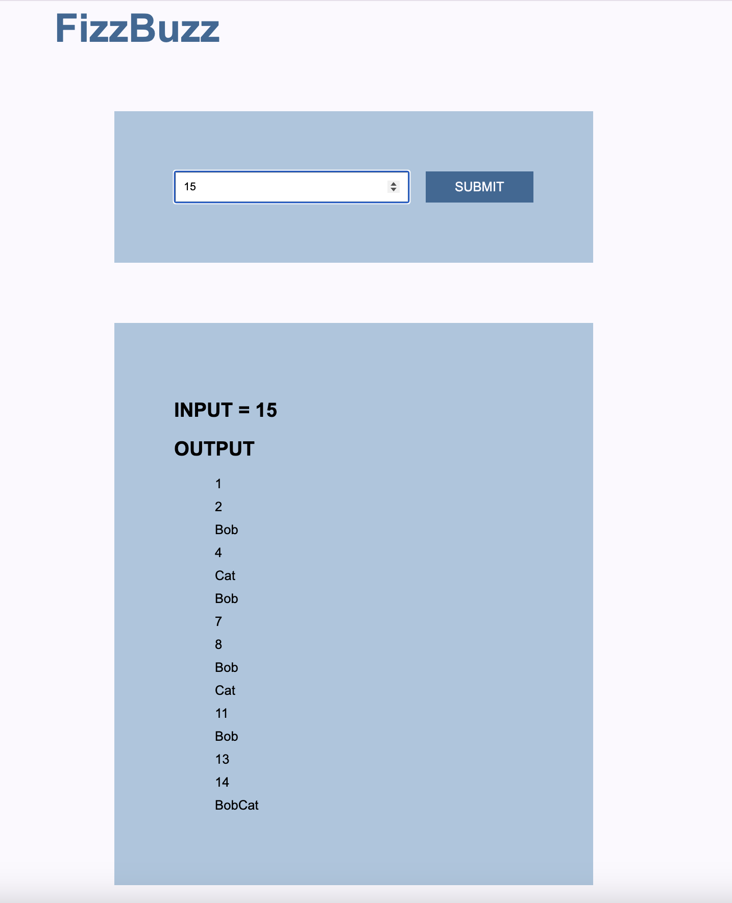

# Fizzbuzz

## Description
This project includes a Python implementation of the classic **FizzBuzz** challenge but with customized outputs. 

A  shell script is used to collect user input and run the Python program with the specified number.
The Python program then prints numbers from 1 to the given number *n*, applying the following rules: 
- For multiples of **3**, print **"Bob"**
- For multiples of **5**, print **"Cat"**
- For multiples of both **3 and 5**, print **"BobCat"**

## Files in the Project
- **main.py:**  
  A Python program that contains the FizzBuzz logic.
- **run.sh:**  
  A shell script that prompts the user for a number and then runs `main.py` with the provided input.

## Prerequisites
- **Python 3.x** must be installed on your system.

## How to Run the Program
1. Open a terminal and navigate to the project directory.
2. Make the shell script executable by running:   
   ```chmod +x run.sh```
3. Run the shell script with
   ```./run.sh```
4. Enter a number when prompted. 

# Unit Testing (Jayce)
- Have created a test.py file for unit tests on your fizzbuzz solution. Had to work around the call to main at the bottom of main.py so that's why there is some harder logic at the beginning of the testing file. 
- Have created run_test.sh which can be accessed by running: 
```chmod +x run_test.sh```
and followed by 
```./run_test.sh```
- NOTE: I tried not to change any of Lucy's work, but changed her ```run.sh``` to run python instead of python3 since Windows has an issue with that. 


# Fizzbuzz Web API
## Description
This project exposes the FizzBuzz solution as an endpoint on a local Flask server. 
The `/fizzbuzz` endpoint displays a form for user input. Upon submission, the server calls the `fizzbuzz` function with the given input and renders the returned result on the page using HTMX.

## How it Works
1. **REDIRECT**: When the user visits the root URL (`/`), they are automatically redirected to the `/fizzbuzz` endpoint.
2. **GET Request**: When the user accesses `/fizzbuzz`, a `GET` request is made, and the server responds by displaying an HTML form where the user can input a number.
3. **POST Request**: When the form is submitted, HTMX sends a `POST` request to `/fizzbuzz`. 
The server then processes the form input, passes the value to the `fizzbuzz` function, and returns an HTML snippet with the result.
The result is dynamically injected into the page by HTMX, without needing a full page reload.

## Files in the Project
- **BobCat_FizzBuzz.py**: Python file that implements the FizzBuzz solution and returns the results as a list of strings.
- **app.py**: The main Flask server file that defines routes and handles HTTP requests.
- **templates/**
  - **fizzbuzz_form.html**: HTML template containing the form where users can input a number.
  - **fizzbuzz_result.html**: HTML template that uses Jinja templating to dynamically render and display the FizzBuzz result.
- **static/**  
  - **styles.css**: CSS file that defines the styles for the application.

## Running the Application
1. Open a terminal and navigate to the project directory.
2. Run the Flask server using the command: 
`flask run`
3. Open a web browser and go to: http://127.0.0.1:5000
4. Enter a number in the form and click the "Submit" button. 
After submitting the form, the application will process the input and display the FizzBuzz result.


## Example Run
Navigating to http://127.0.0.1:5000 issues a `GET` request to the server.



The server responds with an HTML page that includes a form for user input.





In the form, enter a number — for example, `15` — and submit it.
This triggers a `POST` request to `/fizzbuzz`, sending the input as form data.




The server responds to the `POST` request with an HTML snippet containing the user input and FizzBuzz output, which is inserted at the end of the page below the form.


